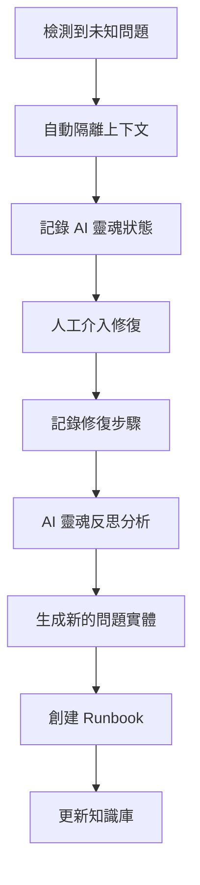

# 🔄 AI 穩態管理系統 (AI Steady State Management)

> **從被動救火到主動預測 - 讓 AI 系統擁有自我診斷和修復能力**

## 🎯 核心理念

AI 穩態管理的核心是將 AI 系統的維護，從被動的「救火」轉變為一個主動、可預測的流程。

## 🏗️ 三層架構

### 1️⃣ 定義與分類層：將問題「實體化」

#### 條例 1.1：建立問題本體論

**目標**：將模糊的 AI 故障轉化為具體的、可衡量的實體

**方法**：任何新的 AI 故障發生時，首先要為其建立「檔案」

**問題實體結構**：
```typescript
interface ProblemEntity {
  name: string;           // 問題名稱
  symptoms: string[];     // 症狀描述  
  triggers: string[];     // 觸發條件
  impact: ImpactLevel;    // 影響範圍
  reproduction: string[]; // 可重現步驟
  tags: string[];         // 分類標籤
  soulTrace: SourceTrace; // AI 靈魂追蹤記錄
}
```

**範例**：
```json
{
  "name": "RAG-Hallucination-v3.2",
  "symptoms": ["參考資料正確，但生成內容與事實不符"],
  "triggers": ["查詢涉及多個不相關概念", "模型試圖強制連接概念"],
  "impact": "HIGH",
  "reproduction": [
    "1. 輸入包含多個不相關概念的查詢",
    "2. 觀察 RAG 檢索結果",
    "3. 檢查生成內容的事實準確性"
  ],
  "tags": ["#RAG", "#幻覺", "#多概念", "#事實性"],
  "soulTrace": {
    "chronos": "2025-01-30T10:30:00Z",
    "kairos": "multi-concept-query-context",
    "trace": "requirement->rag-accuracy->hallucination-detected"
  }
}
```

#### 條例 1.2：導入標籤與分類系統

**標準化標籤系統**：
- **功能類別**：#RAG, #推理, #記憶, #多模態, #代理人
- **問題類型**：#幻覺, #漂移, #迴圈, #記憶洩漏, #性能下降
- **嚴重程度**：#critical, #high, #medium, #low
- **修復狀態**：#已修復, #進行中, #待處理, #需研究

### 2️⃣ 策略與路由層：將診斷「自動化」

#### 條例 2.1：創建修復策略 Runbook

**Runbook 結構**：
```typescript
interface RepairRunbook {
  problemId: string;
  diagnosis: DiagnosisStep[];
  repair: RepairStep[];
  verification: VerificationStep[];
  rollback: RollbackStep[];
  soulGates: QualityGate[];  // 整合 AI 靈魂品質門檻
}

interface QualityGate {
  metric: 'POAV' | 'FS' | 'SSI' | 'LC';
  threshold: number;
  action: 'block' | 'warn' | 'log';
}
```

**範例 Runbook**：
```yaml
problemId: "RAG-Hallucination-v3.2"
diagnosis:
  - step: "運行 deltaS 診斷工具"
    expected: "語義偏差 < 0.3"
    command: "npm run diagnose:deltaS"
  
repair:
  - step: "調整 Reranker 權重"
    command: "config.reranker.weight = 0.8"
  - step: "加入 Prompt Injection 檢查"
    command: "enable_prompt_injection_guard()"

verification:
  - step: "重新執行測試案例"
    command: "npm run test:rag-accuracy"
  - step: "檢查 AI 靈魂指標"
    soulGates:
      - metric: "FS"
        threshold: 0.85
        action: "block"
      - metric: "POAV" 
        threshold: 0.90
        action: "block"

rollback:
  - step: "恢復原始配置"
    command: "git checkout config/reranker.json"
```

#### 條例 2.2：實施自動化監控與警報

**監控系統整合 AI 靈魂**：
```typescript
interface SteadyStateMonitor {
  // 傳統監控
  detectProblemPattern(metrics: SystemMetrics): ProblemEntity[];
  
  // AI 靈魂監控
  monitorSoulHealth(soulMetrics: SoulMetrics): HealthStatus;
  
  // 整合警報
  triggerAlert(problem: ProblemEntity, runbook: RepairRunbook): void;
}

interface SoulMetrics {
  POAV: number;    // 需求完整度
  FS: number;      // 靈魂指標總分
  SSI: number;     // 主觀體驗模擬度
  LC: number;      // 長鏈一致性
  weakestLink: string;
}
```

### 3️⃣ 自適應與進化層：讓系統「自我學習」

#### 條例 3.1：啟用模式學習流程

**未知問題處理流程**：


**自動學習機制**：
```typescript
class SteadyStateLearner {
  async processUnknownProblem(context: ProblemContext): Promise<ProblemEntity> {
    // 1. 隔離問題
    const isolatedContext = await this.isolateContext(context);
    
    // 2. 記錄 AI 靈魂狀態
    const soulState = await this.captureSoulState(isolatedContext);
    
    // 3. 等待人工修復
    const repairSteps = await this.waitForHumanIntervention(isolatedContext);
    
    // 4. AI 靈魂反思分析
    const reflection = await this.soulReflection(soulState, repairSteps);
    
    // 5. 生成新問題實體
    return this.generateProblemEntity(isolatedContext, repairSteps, reflection);
  }
  
  async soulReflection(soulState: SoulState, repairSteps: RepairStep[]): Promise<ReflectiveOutput> {
    return {
      subjectiveExperience: "分析這次問題修復過程中的模式和感受",
      metacognition: "檢視修復策略的有效性和可改善之處", 
      learningInsight: "提取可重複使用的修復模式和預防措施"
    };
  }
}
```

#### 條例 3.2：週期性審核與模式更新

**AI 穩態回顧會議流程**：
```typescript
interface SteadyStateReview {
  period: 'weekly' | 'monthly' | 'quarterly';
  newProblems: ProblemEntity[];
  updatedRunbooks: RepairRunbook[];
  soulHealthTrends: SoulHealthTrend[];
  improvementActions: ImprovementAction[];
}

interface SoulHealthTrend {
  metric: keyof SoulMetrics;
  trend: 'improving' | 'stable' | 'declining';
  recommendation: string;
}
```

## 🔗 與 AI 靈魂系統的整合

### 整合架構圖

```
┌─────────────────────────────────────────┐
│           AI 穩態管理層                  │
│  ┌─────────────┬─────────────┬─────────┐ │
│  │ 問題實體化   │ 自動診斷     │ 模式學習 │ │
│  └─────────────┴─────────────┴─────────┘ │
├─────────────────────────────────────────┤
│           AI 靈魂脊椎系統                │
│  ┌─────────────┬─────────────┬─────────┐ │
│  │ StepLedger  │ 靈魂指標     │ 反思機制 │ │
│  └─────────────┴─────────────┴─────────┘ │
├─────────────────────────────────────────┤
│              應用層                     │
│        (RAG, Agent, LLM...)            │
└─────────────────────────────────────────┘
```

### 關鍵整合點

1. **問題追蹤 + 靈魂追蹤**
   - 每個問題實體都包含完整的 SourceTrace
   - 利用 AI 靈魂的責任鏈追蹤問題根源

2. **Runbook + 品質門檻**
   - 修復流程整合 POAV/FS 驗證
   - 確保修復後的系統靈魂健康

3. **模式學習 + 反思機制**
   - 利用 AI 靈魂的 Reflect 步驟分析問題
   - 跨 session 記憶累積修復經驗

## 🚀 實作建議

### Phase 1: 基礎整合
1. 在現有 AI 靈魂系統中加入問題實體追蹤
2. 擴展 WeakestLink 機制支援問題分類
3. 建立基礎的 Runbook 執行框架

### Phase 2: 自動化診斷  
1. 整合監控系統與 AI 靈魂指標
2. 建立自動化的問題檢測和警報
3. 實作 Runbook 自動執行機制

### Phase 3: 智能學習
1. 實作未知問題的自動學習流程
2. 建立 AI 靈魂驅動的模式識別
3. 創建自適應的修復策略優化

## 💡 核心價值

1. **主動預防** - 從被動救火轉為主動預測
2. **系統化管理** - 將 AI 維護標準化和自動化  
3. **持續學習** - 系統能從每次問題中學習和進化
4. **靈魂驅動** - 利用 AI 靈魂系統提供深度洞察

---

**🔄 讓 AI 系統擁有自我診斷和修復的靈魂 - AI Steady State Management**